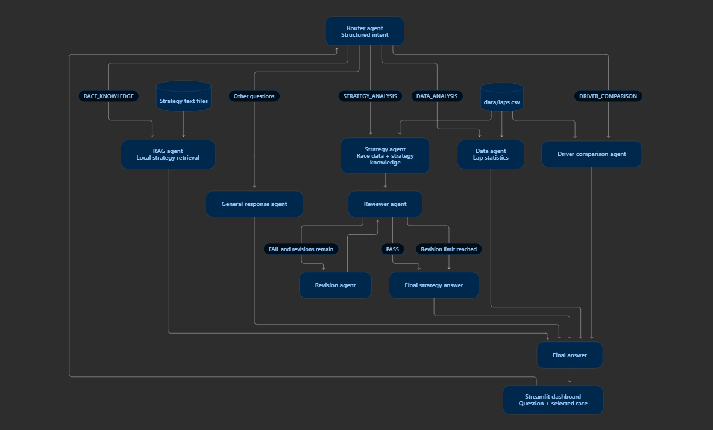
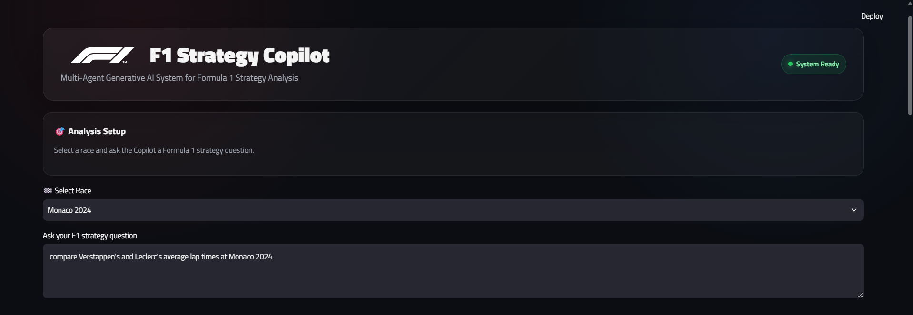
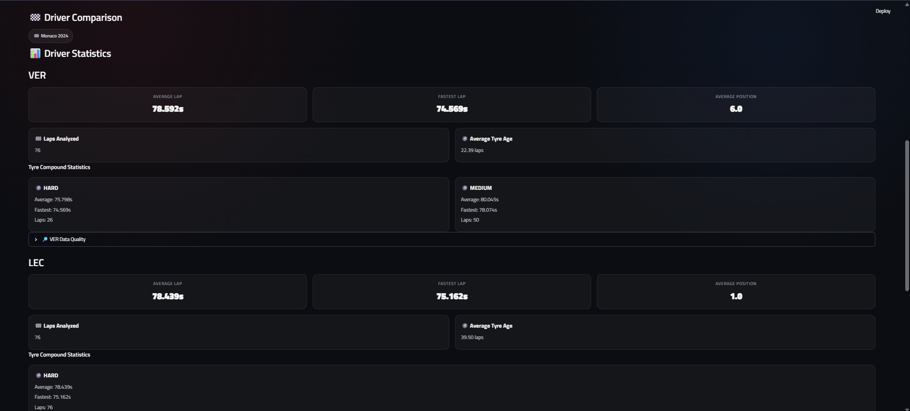
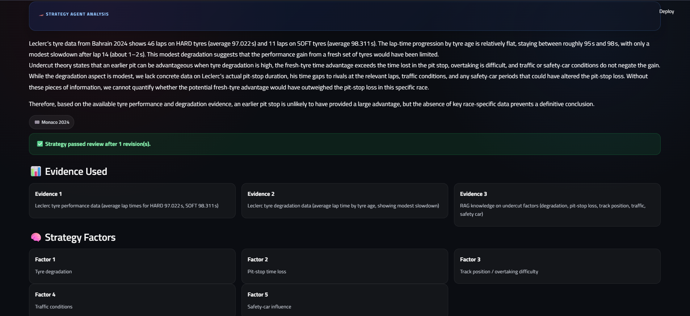
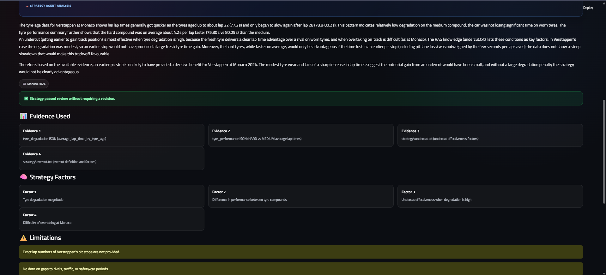

# F1 Strategy Copilot

A Streamlit application that answers Formula 1 race questions using a LangGraph workflow, race-lap data, and a local strategy knowledge base. It can summarize race data, compare drivers, explain strategy concepts, and review strategy recommendations for grounding.

## Features

- **Intent-based routing:** sends each question to the RAG, data analysis, strategy analysis, driver comparison, or general response path.
- **Race knowledge retrieval:** searches a local corpus covering undercuts, overcuts, tyre degradation, and safety-car strategy.
- **Lap-data analysis:** calculates lap-time, tyre, and position summaries from the included 2024 race dataset.
- **Strategy review loop:** checks strategy responses against evidence and can request up to two revisions.
- **Driver comparison:** summarizes each driver's available laps and compares their race statistics.
- **Streamlit interface:** select a race, enter a question, and view the analysis in the F1-themed dashboard.

## System architecture

The system uses a LangGraph workflow with specialised agents for race knowledge retrieval, data analysis, strategy analysis, driver comparison, and general F1 questions. Strategy responses are passed through a reviewer and revision workflow before the final answer is displayed.



*Figure: System architecture of the F1 Strategy Copilot.*

## Technology stack

- Python and Streamlit
- LangGraph for workflow state and conditional routing
- Groq API with the `openai/gpt-oss-120b` model for routing and language generation
- pandas for race-lap calculations
- FAISS for vector similarity search
- ONNX Runtime, Hugging Face Hub, and Tokenizers for local text embeddings using `sentence-transformers/all-MiniLM-L6-v2`
- FastF1 in the optional data download script

## Repository structure

```text
F1/
├── app.py                         # Streamlit user interface
├── graph/
│   ├── state.py                   # Shared workflow state
│   ├── nodes.py                   # Router and agent graph nodes
│   └── workflow.py                # LangGraph edges and routing
├── RAG/
│   ├── rag_agent.py               # Knowledge-grounded answers
│   └── retriever.py               # Embeddings and FAISS search
├── data/
│   ├── data_agent.py              # Lap-data analysis
│   ├── download_f1_data.py        # Optional 2024 data downloader
│   └── laps.csv                   # Included lap dataset
├── strategy/                      # Strategy analysis agent
├── reviewer/                      # Strategy review and revision agents
├── driver_comparison/             # Driver comparison agent
├── knowledge/strategy/            # Local strategy reference text
└── assets/screenshots/            # README screenshots
```

## Getting started

### 1. Clone the repository

```bash
git clone https://github.com/Kaibalya-Mohanty/F1.git
cd F1
```

### 2. Create and activate a virtual environment

```bash
python -m venv .venv
```

Windows PowerShell:

```powershell
.venv\Scripts\Activate.ps1
```

macOS or Linux:

```bash
source .venv/bin/activate
```

### 3. Install dependencies

This repository does not currently include a dependency lock file. Install the packages used by the application with:

```bash
python -m pip install --upgrade pip
python -m pip install streamlit pandas langgraph groq python-dotenv faiss-cpu numpy onnxruntime huggingface-hub tokenizers fastf1
```

### 4. Configure the Groq API key

Create a `.env` file in the project root:

```dotenv
GROQ_API_KEY=your_groq_api_key_here
```

Keep your real API key private. The `.env` file is ignored by Git.

### 5. Run the app

```bash
python -m streamlit run app.py
```

The first retrieval run downloads the embedding tokenizer and ONNX model from Hugging Face. The application also needs network access to call the Groq API.

## Data

The checked-in `data/laps.csv` contains 2024 race-lap summaries with race, driver, lap number, lap time, tyre compound, tyre age, and position fields. The analysis is limited to the information present in that file; it does not include complete telemetry, fuel load, rival gaps, or all pit-stop and race-control context. Strategy answers that depend on those details should be treated as conditional.

To refresh the CSV using the included FastF1 downloader, run:

```bash
python data/download_f1_data.py
```

This script downloads race-session data and may take time and require network access.

## Screenshots

### Dashboard



### Driver comparison — Monaco 2024



### Strategy response example — Leclerc at Bahrain 2024




### Strategy response — Verstappen at Monaco 2024



## Limitations

- The checked-in race dataset covers the 2024 season and contains lap-level summary fields rather than full race telemetry.
- The strategy knowledge files provide general concepts and do not replace event-specific timing and race-control data.
- Results depend on the quality and coverage of the available data and the model response; use them as analysis support, not as live team strategy instructions.
- No automated test suite or formal model-quality benchmark is included in the repository at this time.

## Project link

[Kaibalya-Mohanty/F1 on GitHub](https://github.com/Kaibalya-Mohanty/F1)
